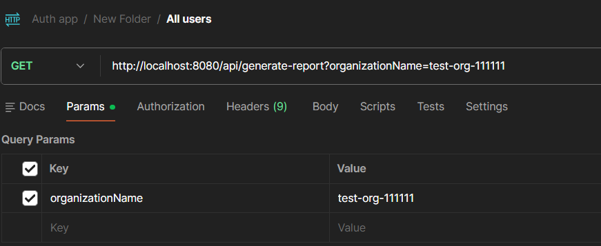
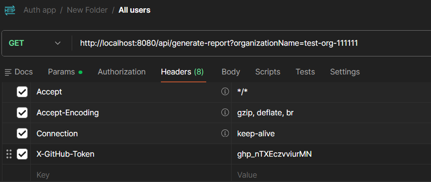
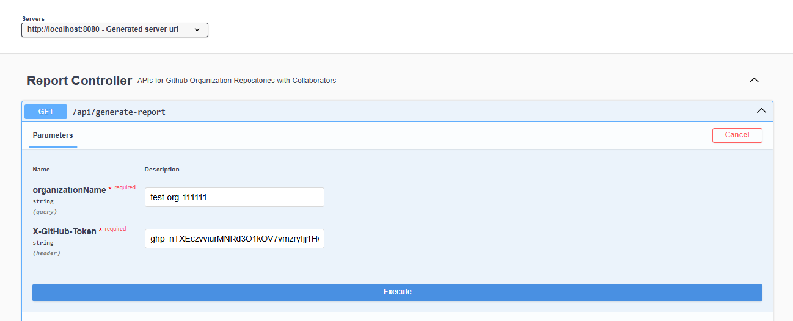
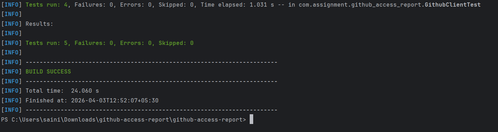

# GitHub Access Report

A simple Spring Boot service that shows **which users have access to which repositories** in a GitHub organization.

---

## 🚀 Quick Start (Run the Project)

Make sure you have:

* Java 17
* Maven

```bash
# Clone the repository
git clone https://github.com/YOUR_USERNAME/github-access-report.git
cd github-access-report

# Build the project
mvn clean install

# Run the application
mvn spring-boot:run
```

Server will start at:

```
http://localhost:8080
```

---

## 🐳 Run with Docker (Optional)

```bash
# Build image
docker build -t github-access-report .

# Run container
docker run -p 8080:8080 github-access-report
```

---


## 📡 API Endpoint

```
GET http://localhost:8080/api/generate-report?organizationName={orgName}
```

### 🔑 Required Header

```
X-GitHub-Token: ghp_yourtoken
```

---

## 🧪 Example Request

### Using cURL

```bash
curl -H "X-GitHub-Token: ghp_yourtoken" \
"http://localhost:8080/api/generate-report?organizationName=yourOrganization"
```

---

### Using Postman

* Method: GET
* URL:

  ```
  http://localhost:8080/api/generate-report?organizationName=netflix
  ```

  

* Headers:

  ```
  X-GitHub-Token: ghp_yourtoken
  ```
  


---

## 📘 Swagger UI (API Testing)

Swagger UI is available at:

```
http://localhost:8080/swagger-ui/index.html
```

👉 You can:

* Enter `organizationName` parameter
* Add Authorization header
* Click **Execute**




---

## ✅ Sample Response

```json
{
  "status": "SUCCESS",
  "message": "Report generated successfully",
  "data": [
    {
      "name": "zuul",
      "collaborators": [
        { "login": "alice", "role_name": "admin" },
        { "login": "bob", "role_name": "write" }
      ]
    }
  ]
}
```

---

## ❌ Error Response Example

```json
{
  "status": 401,
  "message": "Invalid GitHub token",
  "errorCode": "GITHUB_ERROR",
  "timestamp": "2024-04-01T10:30:00Z"
}
```

---

## 🔐 Authentication (Important)

This service uses a **GitHub Personal Access Token (PAT)**.

👉 Instead of passing the token in the URL (which is unsafe), we pass it in the **request header**.

### How to create a token:

1. Go to GitHub → Settings
2. Developer Settings → Personal Access Tokens
3. Click **Generate new token (classic)**
4. Select scopes:

   * `repo`
   * `read:org`
5. Copy the token (starts with `ghp_`)

---

## 🧠 Design Decisions (Explained Simply)

### 1. Parallel Processing

Fetching collaborators for each repo one-by-one is slow.

So we use **CompletableFuture** to call APIs in parallel.

```
Without parallel → very slow
With parallel → much faster
```

---

### 2. Pagination Handling

GitHub API returns max **100 items per page**.

We automatically:

* Loop through all pages
* Combine results

So no data is missed.

---

### 3. Stateless Design

* Token is passed in each request
* Nothing is stored in backend

✔ Simple
✔ Secure
✔ Scalable

---

### 4. Clean Data Structure

Each repository contains its own collaborators:

```
Repository → List of Users
```

This makes it easier for frontend and debugging.

---

### 5. Early Validation

Before calling GitHub API, we check:

* Org name
* Token format

If invalid → return error immediately (no unnecessary API calls)

---

## 📈 Scalability

* Works with 100+ repositories
* Handles large organizations
* Uses parallel calls for speed
* GitHub rate limit: ~5000 requests/hour (authenticated)

---

## 📌 Assumptions

- GitHub token has required permissions (`repo`, `read:org`)
- Organization exists and is accessible
- Only direct collaborators are considered (not team-based access, if applicable)
- API rate limits are within acceptable range

---

## 🧪 Tests

Run tests using:



```bash
mvn test
```

### Covered Cases:

* Pagination logic
* Collaborator mapping
* GitHub API errors (401, 403, 404)
* Input validation


